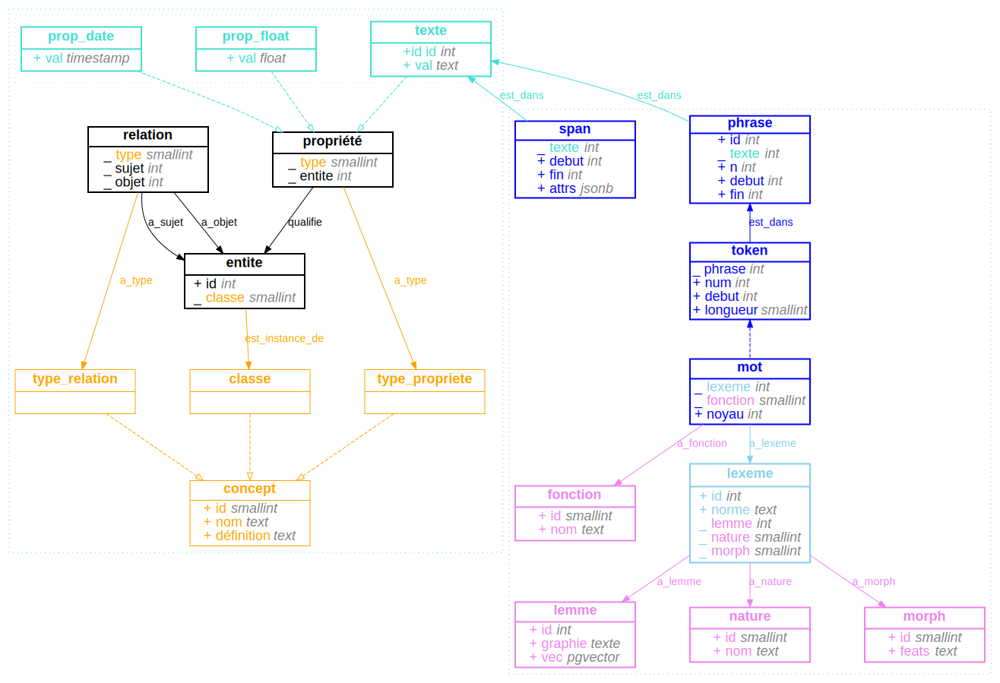

littéralement
=============

__littéralement__ est un schéma de base de données [PostgreSQL](https://www.postgresql.org/) pour l'analyse automatique de textes en français, conçu pour stocker les annotations produites par la librairie [spaCy](https://spacy.io/). C'est aussi une interface minimale en ligne de commande permettant de facilement ajouter des données, d'annoter les textes (avec [spaCy](https://spacy.io/)) et de placer le résultat de ces annotations dans la base de données (voir [usage](#usage), plus bas).

schémas
-------

Les tables du schéma [litteralement](#litteralement) sont destinées à recevoir les données typiquement produites lors de l'annotation automatique par des librairies de _NLP_ (_token_, _word_, _lemma_, _pos_, _dep_, _feats_, etc.). Elles sont organisées de façon à optimiser les performances et l'espace utilisé.

Un autre schéma optionnel, [eav](#eav) (qui implémente un modèle générique/[EAV](https://en.wikipedia.org/wiki/Entity-attribute-value_model) minimal) peut être ajouté au schéma `litteralement` pour avoir une base de données complète et flexible, mais assez sommaire. Le [modèle](https://wiki-arhn.larhra.fr/lib/exe/fetch.php?media=intro_histoire_numerique:beretta_des_sources_aux_donnees_3-8.pdf) générique dont il s'inspire, librement emprunté à Francesco Beretta[^1] (et dont je ne reprends qu'une minuscule partie) est plus complet que ce que désigne le terme [EAV](https://en.wikipedia.org/wiki/Entity-attribute-value_model) (_Entity-Attribute-Value_), puisqu'il n'implémente pas seulement une manière de décrire les propriétés des entités, mais aussi, par exemple, leurs relations.

Ensemble, ces deux schémas constituent donc un modèle EAV hybride, mais ils sont indépendants.

[^1]: Francesco Beretta, "Des sources aux données structurées", 14 octobre 2022, [En ligne](https://wiki-arhn.larhra.fr/lib/exe/fetch.php?media=intro_histoire_numerique:beretta_des_sources_aux_donnees_3-8.pdf), license CC BY-SA 4.0.

Le diagramme ci-dessous représente la structure de la base de données. Chaque rectangle représente une table. Les flèches traitillées représentent les [héritages](https://www.postgresql.org/docs/current/tutorial-inheritance.html) entre tables. La table __mot__ hérite par exemple de la table __token__ les colonnes __texte__, __debut__ et __fin__[^4]. D'un point de vue conceptuelle, la relation d'héritage correspond à la relation _A est une sous-classe de B_[^7]. Les autres flèches (pleines) représentent des _foreign keys_. Les lignes commençant par `_` indiquent, elles aussi des _foreign keys_: la valeur des colonnes en question est toujours `integer` ou, pour des raisons d'optimisation, `smallint`, car il est très improbable pour certaines tables de dépasser le millier de lignes (typiquement: les _part-of-speech tags_ et _dependency labels_, respectivement stockés dans les tables __nature__ et __fonction__). Les colonnes qui commencent par le signe `+` représente des valeurs littérales. Si le nom d'une colonne est souligné, cette colonne est utilisée comme _primary key_ (il s'agit toujours de la colonne `id`).

(Pour une description et détaillées des tables, voir [plus bas](#tables).)



[^4]: Les _foreign keys_ ne se transmettent pas par héritage; elles sont systématiquement ajoutées dans la définition du schéma, ainsi que toutes les autres contraintes.

[^7]: Exemple typique, extrait de la documentation de postgresql: villes et capitales; la table capitale _hérite_ de la table _ville_ (les capitales sont un type spécifique de ville), auquel est ajoutée des propriétés ou contraintes (ex. "état").

usage
-----

__litteralement__ est aussi une mini-interface en ligne de commande permettant de rapidement ajouter des données dans les tables à partir de fichiers JSON (ou JSONL) ou d'annoter des textes et d'insérer les annotations dans les tables (_tokens_, _lemmes_, etc.).

Pour construire une base de données complète, constituée du schéma __litteralement__ et du schéma __eav__:

```bash
psql -c 'create database mydatabase'
litteralement schema both | psql -d 'mydatabase'
```

Pour importer dans les tables du modèle EAV des données au format JSON (le format est décrit plus bas):

```bash
litteralement copy -d 'mydatabase' *.json
```

Pour ajouter le schéma __litteralement__ à une base de données existante, il faut spécifier la table qui contient les textes afin que soient générées les _foreign keys_ des tables du schéma. On spécifie cette table _via_ l'option `-t` et sa valeur doit avoir la forme `SCHEMA.TABLE.PRIMARY_KEY` (la colonne _primary key_ doit être de type `integer`):

```bash
litteralement schema -t 'public.texte.id' | psql mydatabase
```

Pour annoter des textes avec [spaCy](https://spacy.io/) et ajouter le résultat des annotations dans les tables:

```bash
litteralement annotate --dbname mydatabase \
    --model 'fr_core_news_lg' \
    --query 'select id, val from texte'
```

### options

`-l` `--jsonl`
: format JSONL (commande `copy`).

`-t` `--text`
: la table contenant les textes (commande `schema`)

`-q` `--query`
: la requête SQL pour sélectionner les textes à annoter, qui doit retourner deux colonnes: `integer` (_pk_) et `text` (le texte) (commande `annotate`)

#### annotation avec spaCy

`-n` `--n_process`
`-b` `--batch_size`
`-m` `--model`

#### connexion à la base de données

`-d` `--dbname`
`-U` `--user`
`-p` `--port`
`-H` `--host`
`-P` `--password`

<!--
modèle EAV hybride
------------------
- le schéma __eav__ implémente un modèle générique minimal et est destinée à décrire le _monde_ duquel on extrait des textes, qu'il s'agisse des supports matériels qui les contiennent, des acteurices sociaux qui les font circuler ou en relisent le contenu, ou encore des événements qui en motivent la rédaction. la flexibilité de ce modèle permet de décrire un grand nombre de chose très diverses à l'aide d'un nombre restreint et fixe de tables et de colonnes, et d'ajouter de nouveaux types d'objets (ou de relations) sans avoir à modifier le schéma[^2].
- le schéma __litteralement__ est, à l'inverse, conçue pour accueillir des données dont la structure est à la fois prévisible et invariable, car l'analyse automatique des textes se fait souvent à l'aide d'outils et de concepts non seulement relativement standardisés, mais aussi uniformément appliqués: qu'on utilise la librairie [spacy](https://spacy.io/), [stanza](https://stanfordnlp.github.io/stanza/) ou [nltk](https://www.nltk.org/), on manipulera toujours des _sentences_ et des _tokens_, lesquels _tokens_ se verront quasi-systématiquement attribués, entre autres choses, un _lemma_ (lemme), un _part-of-speech tag_ (nature), un _dependency label_ (fonction), des caractéristiques morphologiques représentées selon le format [FEATS](https://universaldependencies.org/format.html#morphological-annotation), un _id_ numérique indiquant leur position dans le texte, etc. et s'il y a évidemment différents _lots_ de propriétés, le choix d'une méthode d'annotation est généralement adoptée pour l'ensemble du corpus (c'est l'élément _invariable_, lequel permet la comparaison et l'analyse). la flexibilité du modèle EAV est donc inutile pour stocker ces données. comme le modèle EAV engendre par ailleurs des baisses importantes de performances, qu'il requiert un espace de stockage plus grand et qu'en plus il complexifie les requêtes (les rendant moins lisibles), il est préférable de construire cette seconde partie selon un modèle relationnel plus standard[^3].
[^2]: il est particulièrement utile si l'on ne sait pas, au départ d'une recherche, ce qu'on va exactement collecter et la manière dont on va organiser le résultat de notre collecte (ou de nos analyses), ou la manière dont les objets de notre recherche peuvent se connecter par l'analyse.
[^3]: on évite par exemple de surcharger la table __entité__ avec des millions de mots.
-->

tables
------

### litteralement

La structure du schéma __litteralement__ n'est pas spécifique à une librairie de nlp[^5], quoi que des modules spécifiques permettent l'analyse avec [spaCy](https://spacy.io/). La délimitation des différents objets, en revanche, est peut-être relativement spécifique à la langue française. En particulier, la table __lexème__ (le mot hors contexte, comme élément du lexique) définit un objet qui regroupe des caractéristiques attribuées par [spaCy](https://spacy.io/) aux __tokens__, mais qui en français ne varient pas d'un contexte à l'autre. En français, peu importe dans quel contexte on rencontrera le mot "magiques", il n'agira toujours de l'adjectif (_part-of-speech_) "magique" (_lemma_) au pluriel (_morphology_), et sa forme graphique canonique (_norm_) sera toujours "magique". Il est donc inutile d'attribuer ces quatre propriétés à chaque occurrence du mot "magique": les propriétés __lemme__, __nature__, __norme__ et __morphologie__ sont donc, dans une base de données __littéralement__, des propriétés des __lexèmes__, tandis que les __mots__ ont des propriétés contextuelles: __fonctions__ (_dep_: par exemple "obj"), __noyau__ (_head_), ainsi que les propriétés héritées des __tokens__ (__debut__, __fin__, __num__), à quoi s'ajoute la référence au __lexème__ dont ils sont une instance. L'ensemble des ligne de la table __mot__ constitue donc le _discours_ (les mots réelles) tandis que l'ensemble des lignes de la table __lexème__ constitue le _lexique_[^6] (les mots possibles).

Les __mots__ eux-mêmes, par ailleurs, sont également un ajout par rapport aux objets utilisés par [spaCy](https://spacy.io/) qui ne différencie pas les différents types de [_tokens_](https://spacy.io/api/token). Or, il n'y a pas de sens à attribuer des _lemmes_ à des signes de ponctuation, à des urls, à des _emoticons_ ou des chiffres, ni à leur associer une _analyse morphologique_ car les chiffres ne sont pas _au pluriel_ ni les urls fléchies. Ces objets textuels sont donc, dans une base de données __littéralement__, des __tokens__ mais pas des __mots__, ils n'ont pas de __fonction__ grammaticale ni de __noyau__ (quoi que cela puisse être discutable), ni non plus de __lexème__ (ce qui est en revanche plus légitime à mon avis). De cette façon, le lexique n'est pas pollué par des nombres, des dates ou des emails (en nombre virtuellement infini).

[^5]: _Natural Language Processing_ (analyse automatique de textes en langage naturel).

[^6]: De la même manière que dans n'importe quel lexique ou dictionnaire, un même forme graphique peut être utilisée dans différentes entrées lexicale: _être-verbe_, _être-nom_, etc.

### eav

Le schéma `eav` est organisé en deux niveaux. Le premier niveau concerne l'ontologie et est constitué des classes d'objets (ex. "personne"), des types de propriétés (ex. "nom") et des types de relations (ex. "connaît"). Le second niveau concerne les individus (lesquels constituent le monde): les objets eux-mêmes (telle personne), les instances de relations (telle relation entre deux personnes particulières) et les instances de propriétés (le nom de telle personne).

- La table __entité__ regroupe les choses du monde: personnes, lieux, objets matériels, idées, n'importe quoi que l'on veut pouvoir désigner et mettre en relation avec d'autres choses. Ses colonnes sont réduites au minimum: un `id` qui permet d'y faire référence et une `classe` qui en définit la nature. La valeur dans la colonne `classe` est l'identifiant (`id`) d'une ligne de la table __classe__ qui contient aussi les colonnes __nom__ (unique et nécessaire) et __definition__ (optionnelle, sans contrainte). La table __classe__ est identique aux tables __type_relation__ et __type_propriete__ (qui ont une position et une fonction identique pour les tables __relation__ et __propriete__), c'est pourquoi elles sont définies dans le diagramme comme étant toutes dérivées d'une table __concept__ (en fait un `type` et non une `table`).
- La table __relation__ met en lien deux entités (__sujet__ et __objet__).
- La table __propriete__ permet d'assigner des propriétés aux entités. Une propriété peut optionnellement avoir une valeur et cette valeur peut avoir différents _datatype_: le type de propriété "age" requiert une valeur numérique entière (`integer`), tandis que la propriété "existe" ne nécessite aucune valeur. La propriété "existe" sera donc placée dans la table __propriété__, qui n'a pas de colonne __val__ tandis que la propriété "age" sera placée dans la table __prop_int__, laquelle table hérite de la table __propriete__ et possède en plus une colonne __val__ dont la valeur est un entier (`integer`). Naturellement, il est aussi possible d'insérer manuellement des données "age" comme texte dans la table destinée aux valeurs textuelles, ou dans celle qui est dédiée au format `jsonb`. Le plus facile, néanmoins, est d'utiliser les modules proposés pour l'importation qui insère automatiquement dans la table appropriée (voir plus bas). (Il y a en réalité davantage de table propriétés que dans le diagramme ci-dessous.)

C'est par la table __texte__ que sont mises en lien les deux parties de la base de donneés. Elle hérite de la table __propriete__, tout comme les tables __prop_int__ ou __prop_float__ mais elle a également une colonne `id` qui est référencée par les table __phrase__ et __span__.

format d'importation (eav)
--------------------

Si l'insertion d'entités, de propriétés ou de relations peut évidemment se faire manuellement, il est aussi possible d'importer des données structurées au format JSON comme suit, chaque objet JSON décrivant une entité, ses propriétés et les relations dont elle est le sujet.

```json
[
    {"id": 1, "classe": "bibliothèque"},
    {"id": 2, "classe": "lieu", "est_magique": null, "magicité": 1.2},
    {
        "classe": "personne", "nom": "becky", "relations": [
            {"type": "fréquente", "objet": 1}
        ]
    },
    {"classe": "livre", "relations": [{"type": "dans", "objet": 1}]},
]
```

Le seul champ requis est, pour chaque entité, le champ `classe`. Le champ `id` permet de définir les relations entre les entités (il ne correspond pas à l'`id` de l'entité dans la base de données). Dans les entités, tous les champs qui ne sont pas `classe`, `id` ou `relations` sont interprétés comme des propriétés et sont insérées dans les tables qui correspondent au `datatype`:

```python
{"est_magique": None}  # ira dans la table propriete, sans valeur (`null` en JSON!)
{"nom": "becky"}       # ira dans la table texte
{"nom": 1231}          # ira dans la table prop_int
{"nom": 1.2}          # ira dans la table prop_float
{"noms": {"prénom": "!", "nom": "?"}}  # ira dans la table prop_json
```

L'importation se fait à l'aide de la commande `copy`. Tous les arguments positionnels sont traités comme des fichiers à importer:

```bash
litteralement copy -d mydatabase data1.json data2.json ../*.json
```

annoter (litteralement)
-------

L'annotation peut se faire en ligne de commande ou, pour un meilleur contrôle, en utilisant les modules python.

En ligne de commande, deux options sont requises: `--model` et `--query`. L'argument de `--query` doit être une requête SQL retournant deux colonnes: un `integer` (l'`id` des textes) et un `text` (leur contenu). Alternativement, la valeur spéciale `all` peut être passée, pour annoter tous les textes pas encore annoter.

```bash
litteralement annotate --dbname mydatabase \
    --model './path/to/my/model' \
    --query 'all' \
    --n_process 2 \
    --batch_size 500
```

```python
import psycopg
import litteralement.nlp.text_annotation
import spacy

dbname = "litteralement"
conn = psycopg.connect(dbname=dbname)
nlp = spacy.load("fr_core_news_lg")

litteralement.nlp.text_annotation.annoter(
    # connection à la database
    conn,
    # la requête qui doit retourner les ID des textes, et les textes.
    # elle peut en revanche avoir n'importe quelle condition.
    # pour annoter tous les textes pas encore annotés, passer 'all'.
    query="select id, val from texte", 
    # le modèle de langue chargé par spacy.
    nlp=nlp,
)
```

La fonction d'annotation, par défaut, insère automatiquement les données dans les textes, mais c'est un comportement qui peut être modifié pour que les annotations soient simplement placées dans la table `litteralement._document` en passant la valeur `True` dans le paramètre `noinsert`. Le paramètre `isword`, quand à lui, permet de passer une fonction qui distinguera les __mots__ des simples __tokens__. Pour que tous les _tokens_ soient sans distinctions placés dans la table __mot__, on pourra donc simplement passer une fonction qui retourne toujours la valeur `True`:

```python
litteralement.nlp.text_annotation.annoter(
    conn, query="select id, val from texte", nlp=nlp,
    isword=lambda token: True,  # tous les tokens dans la table 'mot'
    noinsert=True  # pas d'insertion
)

# on peut ensuite insérer les annotations à l'aide de la fonction suivante:
litteralement.nlp.row_insertion.inserer(conn)
```

Des propriétés supplémentaires peuvent être ajoutées dans des colonnes supplémentaires (pour l'instant seulement pour les lexèmes). Pour chaque propriété additionnelle, un `dict` définit un _nom_ de propriété (le nom de la colonne, et éventuellement de la table associée), un _datatype_, une _function_ permettant d'obtenir la valeur à partir d'un `Token`, définit aussi si la valeur est une valeur littérale ou s'il faut récupérer l'`id` dans une table de référence (comme pour les _part-of-speech tags_, par exemple). La colonne et la tables sont créées automatiquement si elles n'existent pas. Si la valeur est stockée dans une table de référence, il faut spécifier le nom de la colonne qui contient cette valeur dans le paramètre _value_column_.

```python
import viceverser

nlp.add_pipe('viceverser_lemmatizer')
lex_user_attrs = [
    {
        "name": "vv_pos",
        "function": lambda token: token._.vv_pos,
        "is_literal": False,
        "datatype": "jsonb",
        "value_column": "val"
    },
    {
        "name": "vv_morph",
        "function": lambda token: token._.vv_morph,
        "is_literal": False,
        "datatype": "jsonb",
        "value_column": "val",
    },
]

# ces annotations supplémentaires seront automatiquement
# importées dans la table "lexeme", dans une colonne "random_morph".
litteralement.nlp.text_annotation.annoter(
    conn,
    lex_user_attrs=lex_user_attrs
)
```
