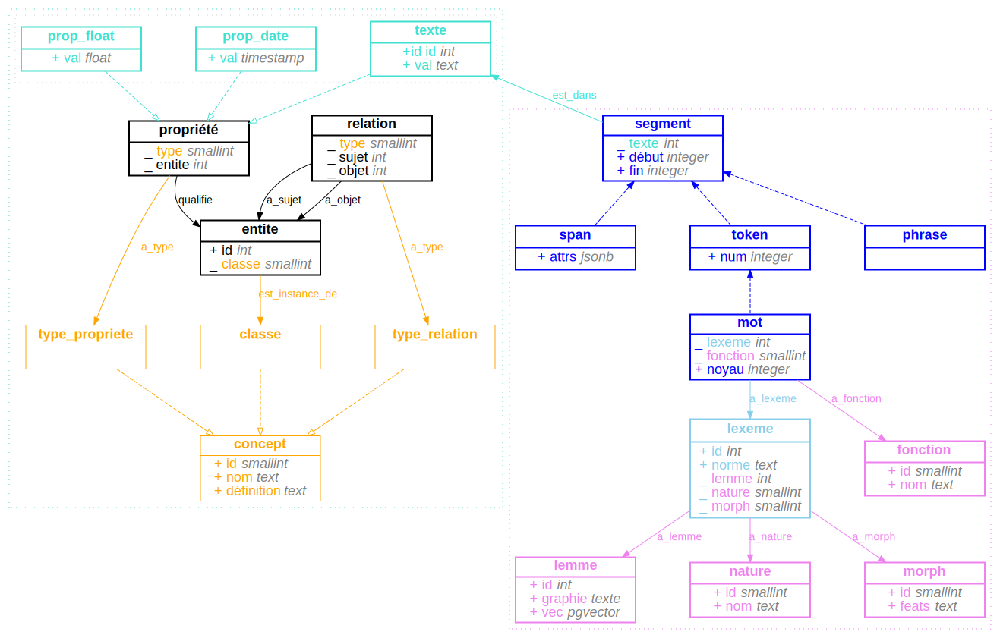

littéralement
=============

__littéralement__ est un schéma de base de données [postgresql](https://www.postgresql.org/) conçu pour l'analyse de texte en français et construit selon un modèle générique (EAV) hybride.

le modèle générique que j'utilise comme base[^1] est plus complet que ce que désigne le terme [EAV](https://en.wikipedia.org/wiki/Entity-attribute-value_model) (_Entity-Attribute-Value_), puisqu'il n'implémente pas seulement une manière de décrire les propriétés des entités, mais aussi, par exemple leurs relations.

[^1]: Francesco Beretta, "Des sources aux données structurées", 14 octobre 2022, [En ligne](https://wiki-arhn.larhra.fr/lib/exe/fetch.php?media=intro_histoire_numerique:beretta_des_sources_aux_donnees_3-8.pdf), license CC BY-SA 4.0.

modèle EAV hybride
------------------

- une première partie implémente un modèle générique et est destinée à décrire le _monde_ duquel on extrait des textes, qu'il s'agisse des supports matériels des textes, des acteurices sociaux qui les font circuler ou en relisent le contenu, ou encore des événements qui en motive la rédaction. la flexibilité de ce modèle permet de décrire un grand nombre de chose très diverses à l'aide d'un nombre restreint et fixe de tables, et d'ajouter de nouvelles _classes_ ou de nouveaux _types de propriétés_ sans avoir à modifier le schéma[^2].
- la seconde partie de la base de données est, à l'inverse, conçue pour accueillir des données dont la structure est à la fois prévisible et invariable, car l'analyse automatique des textes se fait souvent à l'aide d'outils et de concepts de base non seulement relativement standards, mais aussi uniformément appliqués: qu'on utilise la librairie [spacy](https://spacy.io/), [stanza](https://stanfordnlp.github.io/stanza/) ou [nltk](https://www.nltk.org/), on manipulera toujours des _sentences_ et des _tokens_, lesquels _tokens_ se verront quasi-systématiquement attribués, entre autres choses, un _lemma_ (lemme), un _part-of-speech tag_ (nature), un _dependency label_ (fonction), des caractéristiques morphologiques représentées selon le format [FEATS](https://universaldependencies.org/format.html#morphological-annotation), un _id_ numérique indiquant leur position dans le texte, etc. et s'il y a évidemment différentes _stocks_ de propriétés, le choix d'une méthode d'annotation est généralement adoptée pour l'ensemble du corpus (c'est l'élément _invariable_, lequel permet la comparaison et l'analyse). la flexibilité du modèle EAV est donc inutile pour stocker ces données. comme le modèle EAV engendre par ailleurs des baisses importantes de performances, qu'il requiert un espace de stockage plus grand et qu'en plus il complexifie les requêtes (les rendant moins lisibles), toutes les raisons sont là pour ne pas l'utiliser ici[^3].

[^2]: il est particulièrement utile si l'on ne sait pas, au départ d'une recherche, ce qu'on va exactement collecter et la manière dont on va organiser le résultat de notre collecte (ou de nos analyses), ou la manière dont les objets de notre recherche peuvent se connecter par l'analyse.
[^3]: on évite par exemple de surcharger la table "entité" avec des millions de mots.

le diagramme ci-dessous représente la structure de la base de données. chaque rectangle représente une table. les flèches traitillées représentent les [héritages](https://www.postgresql.org/docs/current/tutorial-inheritance.html) entre classes: la table _mot_ hérite de la table _token_ qui elle-même hérite de la table _segment_. ainsi, la table mot possède les colonnes _texte_, _debut_ et _fin_[^4]. les autres flèches représentent des _foreign keys_. les lignes commençant par `_` indiquent, elles-aussi des _foreign keys_: la valeur des colonnes en question est toujours `int` ou, pour des raisons d'optimisation, `smallint`, car certaines tables ont peu de chances de dépasser le millier de lignes (typiquement: les _part-of-speech tags_ et _dependency labels_, respectivement stockés dans les tables _nature_ et _fonction_). les colonnes qui commencent par le signe `+` représente des valeurs littérales. si le nom d'une colonne est souligné, cette colonne est utilisée comme _primary key_.

[^4]: les _foreign keys_ (comme, pour le cas de segment, _texte.id_) ne se transmettent par par héritage; elles sont systématiquement ajoutées dans la définition du schéma, ainsi que toutes les autres contraintes.

