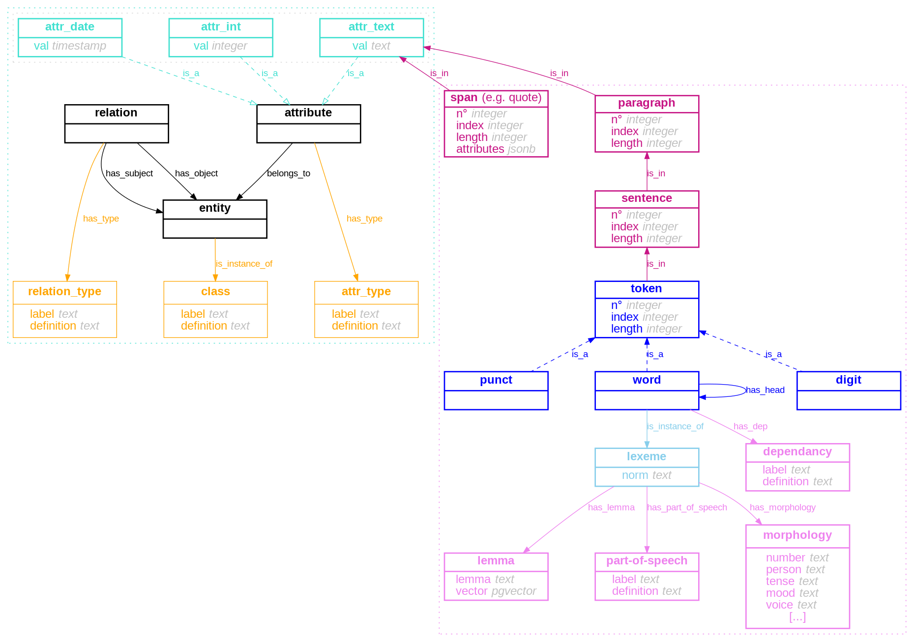

postgrespacy
=============

__postgrespacy__ est un schéma de base de données [PostgreSQL](https://www.postgresql.org/) pour l'analyse automatique de textes en français, conçu pour stocker les annotations produites par la librairie [spaCy](https://spacy.io/). C'est aussi une interface minimale en ligne de commande permettant de facilement ajouter des données, d'annoter les textes (avec [spaCy](https://spacy.io/)) et de placer le résultat de ces annotations dans la base de données (voir [usage](#usage), plus bas).

schémas
-------

Les tables du schéma [postgrespacy](#postgrespacy) sont destinées à recevoir les données typiquement produites lors de l'annotation automatique par des librairies de _NLP_ (_token_, _word_, _lemma_, _pos_, _dep_, _feats_, etc.). Elles sont organisées de façon à optimiser les performances et l'espace utilisé[^DatabaseNormalization].

[^DatabaseNormalization]: Voir les principes généraux de la *normalisation de base de données*: https://en.wikipedia.org/wiki/Database_normalization

Un autre schéma optionnel, [eav](#eav) (qui implémente un modèle générique/[EAV](https://en.wikipedia.org/wiki/Entity-attribute-value_model) minimal) peut être ajouté au schéma `postgrespacy` pour avoir une base de données complète et flexible, mais assez sommaire. Le [modèle](https://wiki-arhn.larhra.fr/lib/exe/fetch.php?media=intro_histoire_numerique:beretta_des_sources_aux_donnees_3-8.pdf) générique dont il s'inspire, librement emprunté à Francesco Beretta[^1] (et dont je ne reprends qu'une minuscule partie) est plus complet que ce que désigne le terme [EAV](https://en.wikipedia.org/wiki/Entity-attribute-value_model) (*Entity-Attribute-Value*), puisqu'il n'implémente pas seulement une manière de décrire les propriétés des entités, mais aussi, par exemple, leurs relations.

[^1]: Francesco Beretta, _Des sources aux données structurées_, 14 octobre 2022, CC BY-SA 4.0. [En ligne](https://wiki-arhn.larhra.fr/lib/exe/fetch.php?media=intro_histoire_numerique:beretta_des_sources_aux_donnees_3-8.pdf)

Ensemble, ces deux schémas constituent donc un modèle EAV hybride, mais ils sont indépendants.

Le diagramme ci-dessous représente la structure de la base de données. Chaque rectangle représente une table. Les flèches traitillées représentent les [héritages](https://www.postgresql.org/docs/current/tutorial-inheritance.html) entre tables. La table `word` hérite par exemple de la table `token` les colonnes `sent`, `i`, `idx` et `len`[^4] (voir la documentation de [spaCy](https://spacy.io/api/token#attributes) pour ces propriétés). D'un point de vue conceptuelle, la relation d'héritage correspond à la relation _A est une sous-classe de B_[^7]. Les autres flèches (pleines) représentent des *foreign keys*. Les lignes commençant par `_` indiquent, elles aussi des *foreign keys*: la valeur des colonnes en question est toujours `integer` ou, pour des raisons d'optimisation, `smallint`, car il est très improbable pour certaines tables de dépasser le millier de lignes (typiquement: les *part-of-speech tags* et *dependency labels*, respectivement stockés dans les tables __nature__ et __fonction__). Les colonnes qui commencent par le signe `+` représente des valeurs littérales. Si le nom d'une colonne est souligné, cette colonne est utilisée comme *primary key* (il s'agit toujours de la colonne `id`).

(Pour une description et détaillées des tables, voir [plus bas](#tables).)



[^4]: Les _foreign keys_ ne se transmettent pas par héritage; elles sont systématiquement ajoutées dans la définition du schéma, ainsi que toutes les autres contraintes.

[^7]: Exemple typique, extrait de la documentation de PostgreSQL: villes et capitales; la table capitale _hérite_ de la table _ville_ (les capitales sont un type spécifique de ville), auquel est ajoutée des propriétés ou contraintes (ex. "état").

usage
-----

__postgrespacy__ est aussi une mini-interface en ligne de commande permettant de rapidement ajouter des données dans les tables à partir de fichiers JSON (ou JSONL) ou d'annoter des textes et d'insérer les annotations dans les tables (_tokens_, _lemmes_, etc.).

### création de la base de données

Pour construire une base de données complète, constituée du schéma __postgrespacy__ et du schéma __eav__:

```bash
psql -c 'create database mydatabase'
postgrespacy schema both -d mydatabase
```

Pour ajouter le schéma __postgrespacy__ à une base de données existante, il faut spécifier la table qui contient les textes afin que soient générées les _foreign keys_ des tables du schéma. On spécifie cette table _via_ l'option `-t`, dont l'argument doit avoir la forme `<schema.table.primary_key>` (la colonne _primary key_ doit être de type `integer`):

```bash
postgrespacy schema postgrespacy -t 'public.texte.id' -d myd
```

### insertion de données (schéma EAV)

Pour importer dans les tables du modèle EAV des données au format JSON ou JSONL (respectant une structure spécifique décrite plus bas):

```bash
postgrespacy copy -d 'mydatabase' *.json
postgrespacy copy --dbname 'mydatabase' --jsonl *.jsonl
```

# annotation de textes

Pour annoter des textes avec [spaCy](https://spacy.io/) et ajouter le résultat des annotations dans les tables, on utilise la commande `annotate`, qui requière deux arguments: `model` et `query`. Ce dernier doit être un fichier (ou `-` pour lire depuis `stdin`) contenant une requête SQL retournant deux colonnes: un `text` (leur contenu) et un `int` (l'`id` des textes).

```bash
postgrespacy annotate fr_core_news_sm query.sql --dbname mydb
postgrespacy annotate ./path/to/a/model/ - -d mydb  << EOF
SELECT
    val, id
FROM string
EOF
```

La distinction entre les *mot* et les autres *tokens* se fait en utilisant l'attribut `Token._.isword`. Par défault, tous les *tokens* seront considérés comme des mots. Si la pipeline utilisée définit une extension `Token._.isword`, celle-ci sera utilisée pour faire la distinction. L'option `-w`/`--isword` permet également de passer une fonction, laquelle doit être enregistrée le [registry misc](https://spacy.io/api/top-level#registry) de spaCy.

options
-------

La liste complète des options est disponible *via* l'option `-h`, `--help`.

tables
------

### postgrespacy

Si la structure du schéma __postgrespacy__ n'est pas spécifique à une librairie de _NLP_[^5], elle est toutefois désignée de façon à fonctionner avec [spaCy](https://spacy.io/). La délimitation des différents objets est peut-être relativement spécifique à la langue française.
En particulier, la table `lexeme` (le mot hors contexte, comme élément du lexique) définit un objet qui regroupe des caractéristiques attribuées par [spaCy](https://spacy.io/) aux `token`, mais qui en français ne varient pas d'un contexte à l'autre. En français, peu importe dans quel contexte on rencontrera le mot "magiques", il n'agira toujours de l'adjectif (_part-of-speech_) "magique" (_lemma_) au pluriel (_morphology_), et sa forme graphique canonique (_norm_) sera toujours "magique". Il est donc inutile d'attribuer ces quatre propriétés à chaque occurrence du mot "magique": les propriétés `lemma`, `pos`, `norm` et `morph` sont donc, dans une base de données __postgrespacy__, des propriétés des `lexemes` tandis que les `words` ont des propriétés contextuelles: `dep` (la fonction grammaticale, par exemple "obj"), `head` (noyau), ainsi que les propriétés héritées des `tokens` (`len`, `i`, `idx`), à quoi s'ajoute la référence au `lexeme` dont ils sont une instance. L'ensemble des ligne de la table `word` constitue donc le _discours_ (les mots réelles) tandis que l'ensemble des lignes de la table `lexeme` constitue le _lexique_[^6] (les mots possibles).

Les mots (table *word*) eux-mêmes, par ailleurs, sont également un ajout par rapport aux objets utilisés par [spaCy](https://spacy.io/) qui ne différencie pas les différents types de [_tokens_](https://spacy.io/api/token). Mais, il n'est pas très intéressent d'attribuer des _lemmes_ à des signes de ponctuation, à des urls, à des _emoticons_ ou des chiffres, ni à leur associer une _analyse morphologique_ car les chiffres ne sont pas _au pluriel_ ni les urls fléchies. Ces objets textuels sont donc, dans une base de données __postgrespacy__, des __tokens__ mais pas des mots, ils n'ont pas de fonction grammaticale (*dep*) ni de noyau (*head*), ni non plus de lexème (ce qui est en revanche plus légitime à mon avis). De cette façon, le lexique n'est pas pollué par des nombres, des dates ou des emails (en nombre virtuellement infini).

Lors de l'annotation de textes avec la commande `annotate`, des __vues__ sont automatiquement générées. Leurs noms sont inspirés par les attributs des `Tokens` de spaCy: `sent_`, `word_`, `lexeme_`.

- La vue `sent_` contient les attributs de la table `sent` (le numéro de la phrase dans le texte, `i`; la position de son premier caractère, `idx`; l'id du texte dont elle fait partie, `string`) et ajoute le contenu textuel de la phrase (`s`), qui ne fait pas partie de la table `sent` pour éviter de dupliquer des données textuelles (et est, dans la vue, simplement récupéré *via* la fonction `substring()`).
- La vue `lexeme_` contient l'`id` du `lexeme` et les valeurs des tables `pos`, `dep` et `morph` plutôt que leurs `ids`. Les *features* contenues dans la table `morph`, qui peuvent varier d'un langage à l'autres, sont automatiquement ajoutées en tant que colonnes de la vue `lexeme_`. Un label morphologique comme `Number=Sing|Number[psor]=Plur|Person=3` sera représenté à l'aide des colonnes `number`, `number_psor` et `person`, qui contiendront des valeurs `text`.
- La vue `word_` contient les propriété de la table `word`, jointe à la vue `lexeme_`, et reliées aux tables `sent` et `par`.

[^5]: *Natural Language Processing* (analyse automatique de textes en langage naturel).

[^6]: De la même manière que dans n'importe quel lexique ou dictionnaire, un même forme graphique peut être utilisée dans différentes entrées lexicale: *être-verbe*, *être-nom*, etc.

### eav

Le schéma `eav` est organisé en deux niveaux. Le premier niveau concerne l'ontologie et est constitué des classes d'objets (ex. "personne"), des types de propriétés (ex. "nom") et des types de relations (ex. "connaît"). Le second niveau concerne les individus (lesquels constituent le monde): les objets eux-mêmes (telle personne), les instances de relations (telle relation entre deux personnes particulières) et les instances de propriétés (le nom de telle personne).

- La table __entity__ regroupe les choses du monde: personnes, lieux, objets matériels, idées, n'importe quoi que l'on veut pouvoir désigner et mettre en relation avec d'autres choses. Ses colonnes sont réduites au minimum: un `id` qui permet d'y faire référence et une `classe` qui en définit la nature. La valeur dans la colonne `classe` est l'identifiant (`id`) d'une ligne de la table __class__ qui contient aussi les colonnes __name__ (unique et nécessaire) et __definition__ (optionnelle, sans contrainte). La table __classe__ est identique aux tables __relation_type__ et __attr_type__ (qui ont une position et une fonction identique pour les tables __relation__ et __attribute__), c'est pourquoi elles sont définies dans le diagramme comme étant toutes dérivées d'une table __concept__ (en fait un `type` et non une `table`).
- La table __relation__ met en lien deux entités (sujet et objet, __sub__ et __obj__).
- La table __attribute__ permet d'assigner des propriétés aux entités. Une propriété peut optionnellement avoir une valeur et cette valeur peut avoir différents _datatypes_: le type de propriété "age" requiert une valeur numérique entière (`integer`), tandis que la propriété "existe" ne nécessite aucune valeur. La propriété "existe" sera donc placée dans la table __attribute__, qui n'a pas de colonne __val__ tandis que la propriété "age" sera placée dans la table __attr_int__, laquelle table hérite de la table __attribute__ et possède en plus une colonne __val__ dont la valeur est un entier (`integer`). Naturellement, il est aussi possible d'insérer manuellement des données "age" comme texte dans la table destinée aux valeurs textuelles, ou dans celle qui est dédiée au format `jsonb`. Le plus facile, néanmoins, est d'utiliser les modules proposés pour l'importation qui insère automatiquement dans la table appropriée (voir plus bas). (Il y a en réalité davantage de table propriétés que dans le diagramme ci-dessous.)

C'est par la table __string__ que sont mises en lien les deux parties de la base de données. Elle hérite de la table __attribute__, tout comme les tables __attr_int__ ou __attr_float__ mais elle a également une colonne `id` qui est référencée par les table __par__, __sent__, __span__.

format d'importation (eav)
--------------------

Si l'insertion d'entités, de propriétés ou de relations peut évidemment se faire manuellement, il est aussi possible d'importer des données structurées au format JSON comme suit, chaque objet JSON décrivant une entité, ses propriétés et les relations dont elle est le sujet.

```json
[
    {"id": 1, "classe": "bibliothèque"},
    {"id": 2, "classe": "lieu", "est_magique": null, "magicité": 1.2},
    {
        "classe": "personne", "nom": "becky", "relations": [
            {"type": "fréquente", "objet": 1}
        ]
    },
    {"classe": "livre", "relations": [{"type": "dans", "objet": 1}]},
]
```

Le seul champ requis est, pour chaque entité, le champ `class`. Le champ `id` permet de définir les relations entre les entités (il ne correspond pas à l'`id` de l'entité dans la base de données). Dans les entités, tous les champs qui ne sont pas `class`, `id` ou `relations` sont interprétés comme des propriétés et sont insérées dans les tables qui correspondent au `datatype`:

```python
{"est_magique": None}  # ira dans la table `attribute`, sans valeur (`null` en JSON!)
{"nom": "becky"}       # ira dans la table `string`
{"date_birth": 1231}          # ira dans la table `attr_int`
{"y": 1.2}           # ira dans la table `attr_float`
{"noms": {"prénom": "!", "nom": "?"}}  # ira dans la table `attr_jsonb`
{"?": [1, 2, 3]}  # idem
```

Une exception concerne la table d'attribut `xml`. Y seront ajouté les propriétés dont le nom est préfixé par `xml_`, par exemple `xml_titre` ou `xml_contenu`. Des fonctions permettent de retirer les balises pour l'analyse avec [spaCy](https://spacy.io/) et de les remettre plus tard^[La documentation pour ces fonctions est en cours d'écriture.].

L'importation se fait à l'aide de la commande `copy`. Tous les arguments positionnels sont traités comme des fichiers à importer:

```bash
postgrespacy copy -d mydatabase data1.json data2.json ../*.json
```

# concordance

Des fonctions minimales sont disponibles pour des concordances. Une utilisation minimale:

```sql
select (concord (w, 50)).*
from word_ w where w.lemma in ('écrire', 'calculer')
order by right_context;
```

Pour que l'ordre de tri se fasse sur le contexte gauche, il faut passer par une [CTE](https://www.postgresql.org/docs/current/queries-with.html):

```sql
WITH x AS (
    SELECT
        (concord (w, 50)).*
    FROM
        word_ w
    /* écrire ici les conditions */
    WHERE
        w.norm = 'écrire'
)
SELECT
    x.left_context,
    x.pivot,
    x.right_context
FROM
    x
ORDER BY
    reverse(x.left_context),
    x.right_context;
```

# TODO

- [ ] Fonction d'ajout automatique de `span` à partir de html/xml.
- [ ] Ajout des annotations de `ents` et `spans`.
- [ ] Ajout automatique des *custom attributes* des *tokens*.
- [ ] Ajout (EAV) depuis HTML, MarkDown, ou *plain text*.
- [ ] `Token.tag` (`XPOS`).
- [ ] Génération dynamique des vues pour le schéma EAV.
